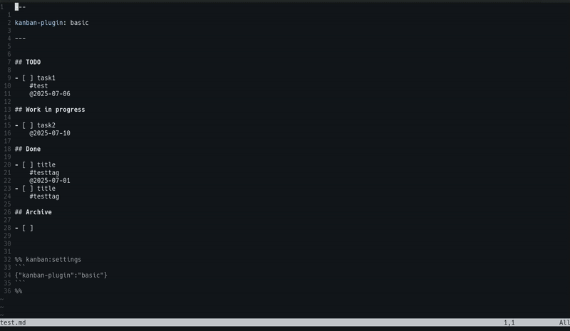
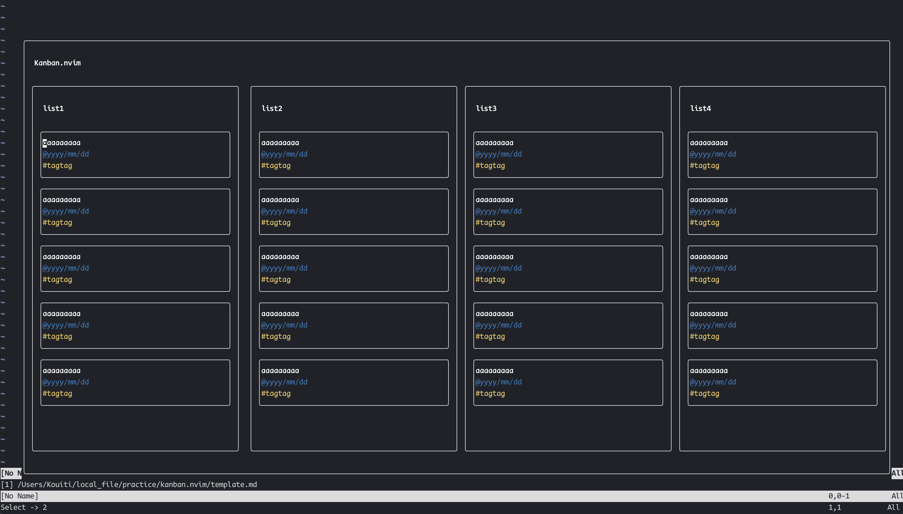

# obsidian-kanban.nvim
[obsidian.nvim](https://github.com/obsidian-nvim/obsidian.nvim) plugin.

Manage task as a kanban board in neovim.
Task information is import and export by markdown file.
Compatible with [obsidian kanban](https://github.com/mgmeyers/obsidian-kanban).

## screenshots


## Requirements
- ripgrep

## Installation
```lua
{
    "obsidian-nvim/obsidian.nvim",
	dependencies = {
		"obsidian-nvim/obsidian-kanban.nvim", -- makes sure your plugin loads first
	},
}
```

## Usage
Create first kanban project.

`:Obsidian kanban create <file_path>`

and open kanban to enter `:Obsidian kanban open <file_path>`.

You can add new tasks with `a` and move cards to focus with `<C-h/j/k/l>`.

You can also move a card with `H/J/K/L`.

See more keymap for information on how to create and move tasks.

In a task card, the first line of text is as the task title, the string beginning with `@` is treated as the deadline, and the characters beginning with `#` are treated as tags.

All setup options are [here](./lua/kanban/ops.lua).

## Format of task cards

- First line is **Task title**.
- Line beginning with `#` are **tag**.
- Line beginning with `@` is **due**.

### Optional telescope search
If you installed telescope.nvim, you can search kanban project files by `:Obsidian kanban telescope` command.

This command search markdown files by `kanban-plugin: .+` which is same options to Obsidian kanban.


## Kaymaps
All keymap are [here](./lua/kanban/keymap.lua).

| Key          | Action                                         |
|--------------|------------------------------------------------|
| <C-h/j/k/l>  | Focus left/below/above/right task.             |
| <S-h/j/k/l>  | Move task to left/below/above/right.           |
| gg           | Focus top task in the list.                    |
| G            | Focus bottom task in the list.                 |
| \<leader\>lr | Rename list.                                   |
| \<leader\>la | Add list.                                      |
| \<leader\>ld | Delete list.                                   |
| \<C-o\>      | Add task.                                      |
| \<C-t\>      | Complete task.                                 |
| :w\<CR\>     | Save kanban.                                   |
| q            | Quit.                                          |
| \<CR\>       | Add task description in another markdown file. |
